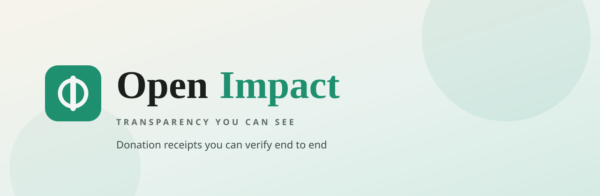

<p align="center">
  
</p>

<h1 align="center">By Team HackonChain</h1>

<p align="center">
  Track every donation from donor to organisation to recipient,<br/>
  with proof of use, privacy built in, and a trust score that cannot be faked in the UI.
</p>

<p align="center">
  <a href="https://hackon-chain.vercel.app/"></a>
  <a href="LICENSE"></a>
  <a href=".github/workflows/ci.yml"></a>
</p>

---

## What it is

**OpenImpact** turns charity into a receipt you can follow.

1. A donor sends funds (wallet stub for now)
2. The recipient confirms they arrived
3. Proof of use lands on that donation (photo, note, thank you)
4. The organisation files a public publication link
5. Only then is the gift **fully accounted for**

Recipient real names stay private. Organisations only see a short brief. The funding donor sees the full story.

## What’s live now

| Area | Status |
|---|---|
| Frontend SPA (Vite + React + TanStack Router) | Live on Vercel |
| Supabase Auth, Postgres, RLS, Storage | Wired |
| Donations, proofs, publications, invites | Read + write paths |
| `org_trust_score` server function | Live |
| GitHub Actions CI (`npm run build`) | Live |
| Web3 settlement | Stub (`connectWallet` / `submitToChain`) |
| Gemini proof check Edge Function | Scaffolded (fail open) |

## Quick start

```bash
git clone https://github.com/Tashbme005/HackonChain.git
cd HackonChain/frontend
cp .env.example .env   # add VITE_SUPABASE_URL + VITE_SUPABASE_ANON_KEY
npm install
npm run dev
```

App: http://localhost:5173

More detail: [`frontend/README.md`](frontend/README.md) · [`backend/README.md`](backend/README.md)

## Repo map

```
frontend/     OpenImpact web app
backend/      Supabase schema, seed, Edge Functions
docs/         Product + backend plans
assets/       Brand banner + mark
```

## Stack

React 19 · Vite 8 · TanStack Router · Tailwind CSS 4 · shadcn/ui · Supabase (Auth, Postgres, RLS, Storage) · Vercel · GitHub Actions

## CI and deploy

- **CI:** `.github/workflows/ci.yml` builds `frontend/` on PRs and pushes
- **CD:** Vercel Git integration (root directory = `frontend`)
- Optional manual Vercel deploy: `.github/workflows/deploy.yml`

Actions config already used by CI:

- Variable `VITE_SUPABASE_URL`
- Secret `VITE_SUPABASE_ANON_KEY`

Mirror those in the Vercel project for production.

## Docs

- [`docs/backend.md`](docs/backend.md)
- [`docs/donor-accountability-requirements.md`](docs/donor-accountability-requirements.md)
- [`CONTRIBUTING.md`](CONTRIBUTING.md)

## License

[MIT](LICENSE)

---

<p align="center">
  
  <br/><br/>
  <sub>OpenImpact · Transparency you can see</sub>
</p>

